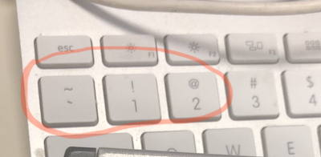
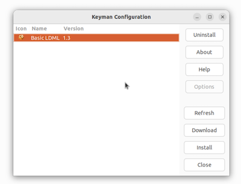
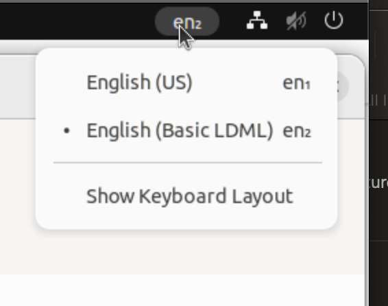
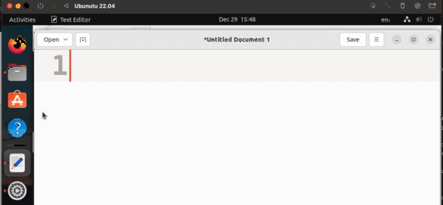
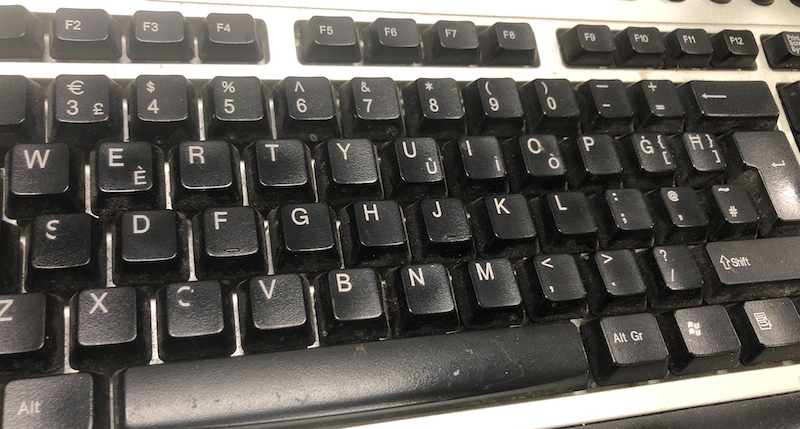
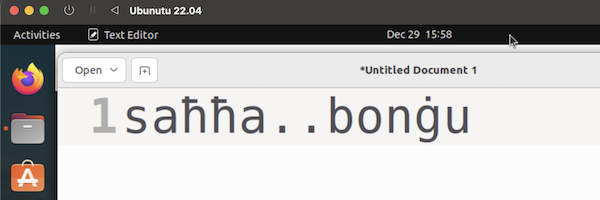
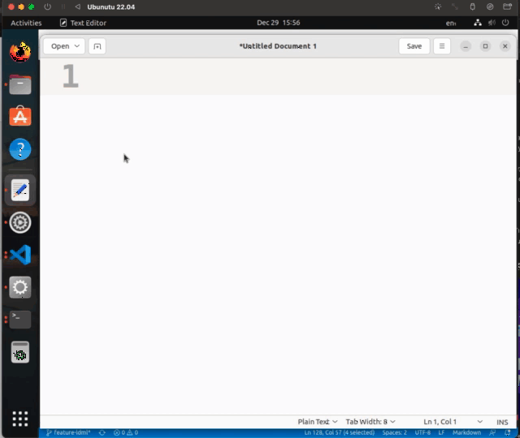

This is a follow-on to the end-of-year [Code Hive Tx 2022](./2022-in-review.md) year end report, so read that first if you would like some greater context.

The purpose of this post is to give some updated progress on the status of implementing CLDR (LDML format) keyboards in [SIL Keyman](https://keyman.com).

---

# Basic Test

In Keyman, there’s a sample XML file named [`basic.xml`](https://github.com/keymanapp/keyman/blob/master/developer/src/kmc-ldml/test/fixtures/basic.xml). It’s not a “real” keyboard, but instead a unit test file. In fact, as a keyboard it has only two keys. Here is the file in part (skipping aspects not relevant to this test):

```xml
<keyboard locale="mt" conformsTo="techpreview">
  <keys>
    <key id="hmaqtugha" to="ħ" />
    <key id="that" to="ថា" />
  </keys>

  <layers form="hardware">
    <layer id="base">
      <row keys="hmaqtugha that" />
    </layer>
  </layers>

</keyboard>
```

Let’s dive in here.

1. The keyboard conforms to a certain CLDR version. We’re still in unreleased territory, so for now the version is `techpreview`.

2. The “key bag” has two named keys.

    - The first is named `hmaqtugha` and is the [Maltese ħ](https://en.wiktionary.org/wiki/ħ#Maltese), known as “H Maqtugħa” [^1] that is “cut H” as opposed to the ordinary H (akka).  By the way, the character `ħ` is Unicode U+0127, which is decimal 295. And now you know the origin of that number in my username.
    - The second key is named `that` because it is the word meaning “that” in Khmer (Cambodian), [ថា](https://en.wiktionary.org/wiki/ថា).

3. There is a single hardware layer, with a single row. That row is the one which in a US Keyboard begins with backquote, 1, 2, 3, etc.



4. So one would expect, using this keyboard, to see `ħ` if the backquote key is pressed, and to see `ថា` if the number 1 is pressed.

## Compiling and Packaging

- I used the in-development Keyman compiler tool, `kmc`, which turned the above XML into a small [`basic.kmx` file](https://help.keyman.com/developer/current-version/reference/file-types/kmx). The tool is written in TypeScript and so is easy to run from any command line via Node.js.

- Next, I hand-built a [`.kps` file](https://help.keyman.com/developer/current-version/reference/file-types/kps), or rather, copied-and-pasted an existing one to suit my needs. This is a Keyman "package source", basically a manifest of which files will end up on the user’s desk. The most exciting part of this xml file is reproduced below:

```xml
   …
   <Files>
    <File>
      <Name>..\build\basic-xml.kmx</Name>
      <Description>Keyboard Basic LDML</Description>
      <CopyLocation>0</CopyLocation>
      <FileType>.kmx</FileType>
    </File>
    …
   </Files>
  <Keyboards>
    <Keyboard>
      <Name>Basic LDML</Name>
      <ID>basic-xml</ID> <!-- MUST MATCH the .kmx name !! -->
      <Version>1.3</Version>
      <Languages>
        <Language ID="en">Anguish Languish</Language>
      </Languages>
    </Keyboard>
  </Keyboards>
```

- As the comment says, the `<ID>` must match the `.kmx` file.  In any event, these files were packaged into a [`basic_ldml.kmp` file](https://help.keyman.com/developer/current-version/reference/file-types/kmp), which, like a `.jar` and many other such packages, is really a zipfile in disguise.

Now I have a Keyman packaged keyboard, just like any of the thousands of other Keyman-format keyboards in the world.

## Firing it up on Linux

Well, sort of.  We actually need a Keyman engine and core which knows how to deal with this new format keyboard.  The LDML format isn't compiled into the existing Keyman binary format, but it is in fact a new variant of the format.

At the moment, compiling the engine and core for Linux, specifically for a separate VM, seemed to be the easiest path to use the new keyboard.  Of course, I expect that someday all copies of Keyman will include this support.

I chose an Ubuntu 22.04 VM and was able to compile Keyman without much trouble. Keyman for Linux has a Python UI for its configuration, and hooks into the [ibus](https://github.com/ibus/ibus/wiki) input framework.

### Installation

Installing was easy, I just clicked Install in the `km-config` UI and chose the `.kmp` file.



Once installed, I could select the new keyboard from the system menu.



### Trying it out

Now we’re ready to actually type in `gedit`!



It’s hard to say a lot with just these two characters. But it is a start.

# Maltese, yet again

Let’s now try to work with a real keyboard, specifically MSA 100:2002 available from [MCCAA](https://mccaa.org.mt/Section/Content?contentId=1243). The hardware here is a [Sirap](https://www.sirap.com.mt) K366P.



In CLDR, the [`mt.xml`](https://github.com/unicode-org/cldr/blob/main/keyboards/3.0/mt.xml) file is available as an example file. It reads in part:

```xml
  <keys>
    <import base="cldr" path="techpreview/key-Zyyy-punctuation.xml"/>
    …
    <key id="c-tikka" to="ċ" />
    <key id="C-tikka" to="Ċ" />
    <key id="g-tikka" to="ġ" />
    <key id="G-tikka" to="Ġ" />
    <key id="h-maqtugha" to="ħ" />
    <key id="H-maqtugha" to="Ħ" />
    <key id="z-tikka" to="ż" />
    <key id="Z-tikka" to="Ż" />
    …
  </keys>
  …
    <layers form="hardware" hardware="iso">
        <layer modifier="none">
            <row keys="c-tikka 1 2 3 4 5 6 7 8 9 0 minus equals" />
            <row keys="q w e r t y u i o p g-tikka h-maqtugha" />
            <row keys="a s d f g h j k l semi-colon hash" />
            <row keys="z-tikka z x c v b n m comma period slash" />
            <row keys="space" />
        </layer>
    </layers>
```

I used an [in-progress pull request](https://github.com/unicode-org/cldr/pull/2633) to flatten the 'import' statement out, as I have not implemented that in `kmc` yet, and also pulled in the 'implied' keys such as:

```xml
<key id="A" to="A" />
<key id="B" to="B" />
<key id="C" to="C" />
etc…
```

The exact file I compiled for this is [here](https://gist.github.com/srl295/500bc22684a3d911995f1a2fcaaca272) if you wish to see it. It had to be slightly edited due a couple of unimplemented features.

## Typing Maltese with a hardware keyboard



And it works also! [^2] Roughly, the above says “Health… Good Morning” which is, all things considered, not a bad way to end this year’s blog posts.




-----

# Footnotes

[^1]: In preparing these articles, I found that I had misspelled “maqtugħa” from memory everywhere. There are PRs in progress to correct this.

[^2]: Ok:  The space bar isn't working, nor the shift layers.  But, it is a start.
